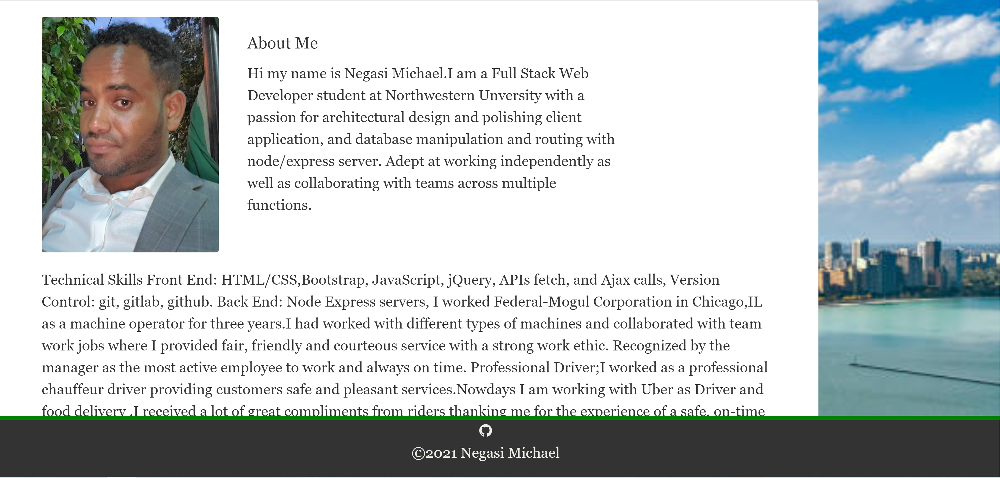
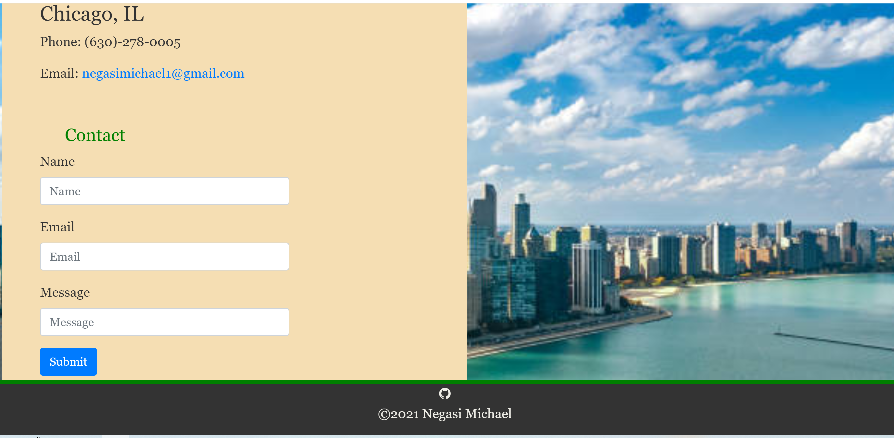
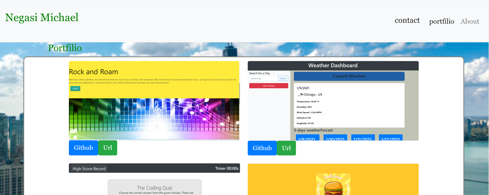

# updated-portfolio

I used  to develop my portfolio with Botstrap layout.I  also develop  my portfolio with: `style.css`,`index.html`, `portfolio.html` and `contact.html` to fuction properly my poftfolio.Using Bootstrap, is very convenient for me to develop my portfolio site. I also to develop my portfolio with a navbar,a responsive layout and responsive images, I Used Bootstrap's grid system (containers, rows, and columns.I but my contact information linkedin link ,github link,resume link in my  portfolio, all links are working properly.

 

 

 

URL https://negasimichael.github.io/Portfolio/
